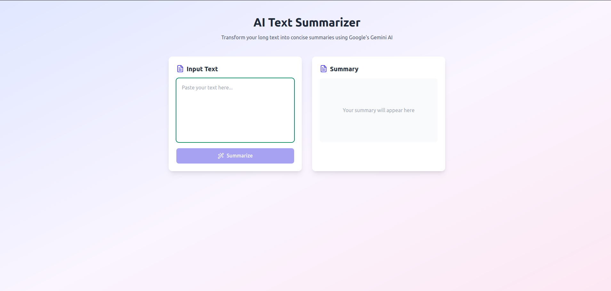
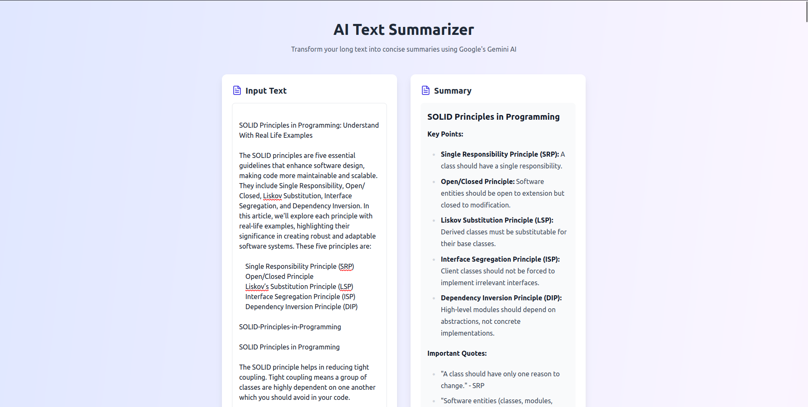

# Polyglot Text Summarizer using MetaCall

## Overview

We'll build a text summarization application that:

1. Uses Python for AI processing (we'll call gemini API for now)
2. Exposes the functionality via a Node.js backend
3. Integrates both using MetaCall's polyglot capabilities



### Installation

1. **Install MetaCall**
    Choose your platform-specific installer from [here](https://github.com/metacall/install).
2. **Get Gemini API Key**
    Obtain your API key from [Google AI Studio](https://aistudio.google.com/app/apikey).

### Implementation

#### Python AI Component (summarizer.py)

```python
import google.generativeai as genai

# Initialize Gemini AI
genai.configure(api_key="<YOUR-API-KEY>")
model = genai.GenerativeModel("gemini-pro")

def summarize(text: str) -> str:
    """Summarize the input text using Gemini AI"""
    if not text.strip():
        return "Error: No text provided for summarization."

    prompt = (
        "Please summarize the following text concisely while maintaining key information.\n"
        "Format the response in markdown with:\n"
        "- A brief overview as a heading\n"
        "- Key points as a bulleted list\n"
        "- Any important quotes in blockquotes\n"
        "- Use bold and italic for emphasis where appropriate\n\n"
        f"Text to summarize:\n{text}"
    )

    response = model.generate_content(prompt)
    return response.text
```

**Note on Implementation:**
This implementation uses the Gemini API as a quick and easy way to demonstrate text summarization. However, in a production or ideal scenario, you would likely want to run your own language model (e.g., fine-tuned GPT, LLaMA, or another open-source model) locally or on your own infrastructure. MetaCall's polyglot capabilities make it seamless to integrate such models written in Python with other components of your stack (e.g., Node.js, C++, etc.).

For example, you could replace the Gemini API call with a local model inference using libraries like `transformers` from Hugging Face. MetaCall would still handle the integration between your Python-based model and the Node.js backend effortlessly.

### Nodejs Server (src/server.js)

```javascript
const { summarize } = require("./src/summarizer.py");
const express = require("express");
const app = express();
const cors = require("cors");
app.use(cors());
app.use(express.json());
const path = require("path");

const start = () => {
  app.use(express.json());

  app.post("/summarize", async (req, res) => {
    try {
      console.log("Received request body:", req.body); //  line
      const { text } = req.body;
      if (!text) {
        return res.status(400).send("Text is required.");
      }

      const summary = await summarize(text);
      res.json({ summary });
    } catch (error) {
      console.error("Error calling Python function:", error);
      res.status(500).json({ error: "Summarization failed." });
    }
  });

  return app.listen(3051, () => {
    console.log("Server listening on port 3051...");
  });
};

module.exports = (() => {
  let server = start();

  return {
    close: () => {
      console.log("Closing server...");
      server && server.close();
    },
  };
})();
```

**Note on Import Path:**
The import statement `require('./src/summarizer.py')` specifies the path relative to the **MetaCall CLI's working directory**, not the location of the JavaScript file. This is because the MetaCall CLI is invoked from the base repository directory (`./`), and it resolves paths relative to that directory

If you prefer to use `require('./summarizer.py')` instead, you would need to run the MetaCall CLI from the `./src` directory. For example:

```bash
cd src
metacall
```

```bash
Welcome to Tijuana, tequila, sexo & marijuana.
λ load node ./server.js
```

### Setup & Execution

1. **Install Dependencies**

    ```bash
    metacall pip3 install google-generativeai
    metacall npm install express
    ```

2. **Start MetaCall CLI**

    ```bash
    metacall
    ```

3. **Load Application**

    ```bash
    load node ./src/server.js
    ```

4. **Run Frontend** (in separate terminal)

    ```bash
    npm install
    npm run dev
    ```

### Testing
Access the application at http://localhost:[frontend-port] and try:

- Input text in the provided field
- Click **Summarize**
- View formatted results with key points and quotes